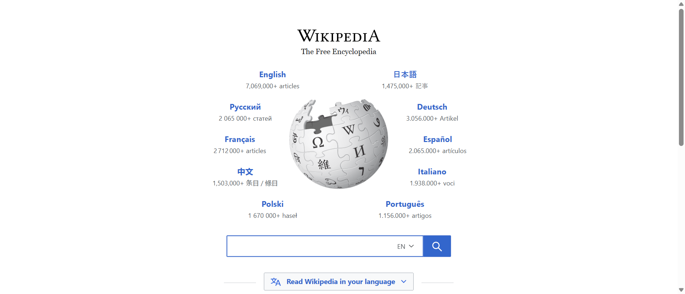

# selenium-webdriver-automation-Ashara
Test automation project showcasing Selenium WebDriver skills with Python. Includes automated browser testing, screenshot evidence, and WebDriver Manager for seamless setup. Perfect for QA automation roles.
# Selenium WebDriver Automation

## 🚀 Project Overview
Successful implementation of Selenium WebDriver automation demonstrating browser control, navigation, and evidence collection.

## ✅ Skills Demonstrated
- Selenium WebDriver setup and configuration
- Automated browser testing
- Screenshot capture for test evidence
- WebDriver Manager for automatic driver management

## 📸 Test Evidence

## 🛠 Technologies Used
- **Python 3.13**
- **Selenium WebDriver 4.28.1**
- **ChromeDriver** (automatically managed)
- **WebDriver Manager 4.0.2**
- **VS Code** IDE

## 👨‍💻 Author
**Ashara Yapa** - Aspiring Test Automation Engineer
